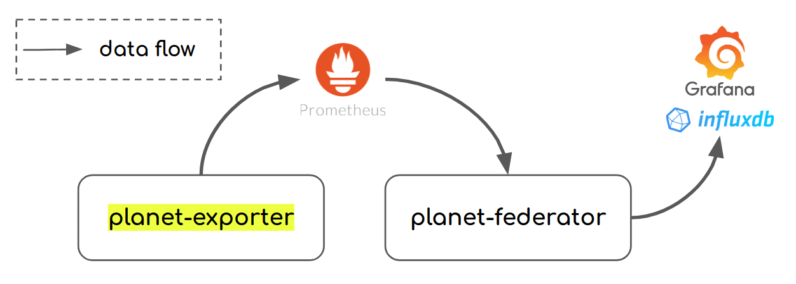
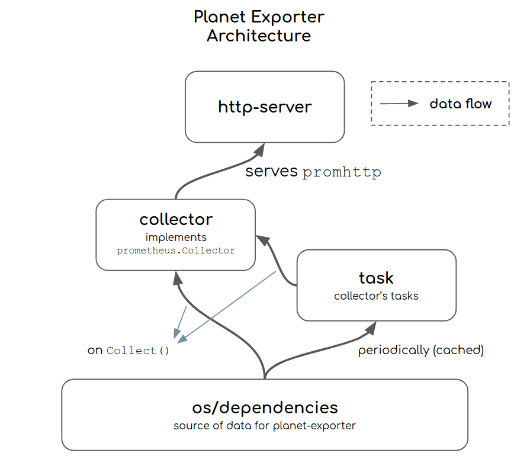

<h1 align="center">Planet Exporter</h1>

<div align="center">
  
</div>
<div align="center">
  <strong>Know your dependencies!</strong>
</div>
<div align="center">
  An <code>experimental</code> code to support my other project.
</div>

<br />

<div align="center">
  <!-- Stability -->
  <a href="https://nodejs.org/api/documentation.html#documentation_stability_index">
    
  </a>
  <!-- Relese -->
  <a href="https://github.com/williamchanrico/planet-exporter/releases">
    
  </a>
  <!-- Apache License -->
  <a href="https://opensource.org/licenses/Apache-2.0">
  </a>
  <!-- Open Source Love -->
  <a href="#">
  </a>
</div>

## Table of Content

  * [Table of Content](#table-of-content)
  * [Introduction](#introduction)
  * [Installation](#installation)
  * [Configuration](#configuration)
  * [Project Structure](#project-structure)
  * [Collector Tasks](#collector-tasks)
    + [Inventory](#inventory)
    + [Socketstat](#socketstat)
    + [Darkstat](#darkstat)
    + [EBPF Exporter](#ebpf-exporter)
  * [Exporter Cost](#exporter-cost)
- [Tools](#tools)
  * [Planet Federator](#planet-federator)
    + [Example InfluxQL](#example-influxql)
- [Go Version](#go-version)
- [Contributing](#contributing)
- [License](#license)

## Introduction

Simple discovery space-ship for your ~~infrastructure~~ planetary ecosystem across the universe.

The primary goal here is to determine every servers' network dependencies (upstream/downstream) along with their bandwidth usage.

Measure an environment's potential to maintain ~~services~~ life.

## Installation

Grab a pre-built binary for your OS from the [Releases](https://github.com/williamchanrico/planet-exporter/releases/latest) page.

## Configuration

There are no required flags. It is configured with usable defaults where only `--task-socketstat-enabled` is on.

```
Usage of planet-exporter:
  -listen-address string
        Address to which exporter will bind its HTTP interface (default "0.0.0.0:19100")
  -log-disable-colors
        Disable colors on logger
  -log-disable-timestamp
        Disable timestamp on logger
  -log-level string
        Log level (default "info")
  -task-darkstat-addr string
        Darkstat target address
  -task-darkstat-enabled
        Enable darkstat collector task
  -task-ebpf-addr string
        Ebpf target address (default "http://localhost:9435/metrics")
  -task-ebpf-enabled
        Enable Ebpf collector task
  -task-interval string
        Interval between collection of expensive data into memory (default "7s")
  -task-inventory-addr string
        HTTP endpoint that returns the inventory data
  -task-inventory-enabled
        Enable inventory collector task
  -task-inventory-format string
        Inventory format to parse the returned inventory data (default "arrayjson")
  -task-socketstat-enabled
        Enable socketstat collector task (default true)
  -version
        Show version and exit
```

Running without any flags (it enables only the socketstat collector task)

```
# planet-exporter
```

Running with inventory and darkstat collector tasks (darkstat has to be installed separately rev >= [e7e6652](https://www.unix4lyfe.org/gitweb/darkstat/commit/e7e6652113099e33930ab0f39630bf280e38f769)). See example darkstat [init.cfg](setup/darkstat/init.cfg).

```sh
planet-exporter \
  -task-inventory-enabled \
  -task-inventory-addr http://link-to-your.net/inventory_hosts.json \
  -task-darkstat-enabled \
  -task-darkstat-addr http://localhost:51666/metrics
```

Running with another inventory format

```sh
planet-exporter \
  -task-inventory-enabled \
  -task-inventory-format "ndjson" \
  -task-inventory-addr http://link-to-your.net/inventory_hosts.json
```

Running with ebpf and custom inventory format

* Follow instructions on https://github.com/cloudflare/ebpf_exporter to start ebpf_exporter with example [tcptop.yaml](setup/ebpf-exporter/tcptop.yaml) configuration.

```sh
planet-exporter \
  -task-ebpf-enabled \
  -task-inventory-enabled \
  -task-inventory-format "ndjson" \
  -task-inventory-addr http://link-to-your.net/inventory_hosts.json
```

## Project Structure



* The `collector` implements prometheus.Collector interface and is the one behind promhttp.Handler. It leverages `task/*` packages for expensive metrics (also as cache) instead of preparing them on every prometheus.Collect.
* The `task/*` packages are the crew that are doing the expensive tasks behind the scene. They store the data for the `collector` package.

## Collector Tasks

This is the heart of Planet Exporter that's doing the heavy-lifting. Integrations with other dependencies happen here.

### Inventory

Query inventory data that will be used to map `ip_address` into `hostgroup` (an identifier based on Ansible convention) and `domain`.
The `ip_address` may use CIDR notation (e.g. "10.1.0.0/16") and Inventory task will use the longest-prefix match.

Without this task enabled, those hostgroup and domain fields will be empty.

Related flags:

* `--task-inventory-enabled=true` to enable the task.
* `--task-inventory-addr` accepts an HTTP endpoint that returns inventory data in the supported format.
* `--task-inventory-format` to choose the supported format for the inventory data.

Inventory formats:

1. --task-inventory-format=arrayjson

```json
[
  {
    "ip_address": "10.1.2.3",
    "domain": "xyz.service.consul",
    "hostgroup": "xyz"
  },
  {
    "ip_address": "10.2.3.4",
    "domain": "debugapp.service.consul",
    "hostgroup": "debugapp"
  },
  {
    "ip_address": "10.3.0.0/16",
    "domain": "",
    "hostgroup": "unknown-but-its-network-xyz"
  }
]
```

2. --task-inventory-format=ndjson

```json
{"ip_address":"10.0.1.2","domain":"xyz.service.consul","hostgroup":"xyz"}
{"ip_address":"172.16.1.2","domain":"abc.service.consul","hostgroup":"abc"}
{"ip_address":"10.3.0.0/16","domain":"","hostgroup":"unknown-but-its-network-xyz"}
```

### Socketstat

Query local connections socket similar to `ss` or `netstat` to build upstream and downstream dependency metrics.

```
# HELP planet_upstream Upstream dependency of this machine
# TYPE planet_upstream gauge
planet_upstream{local_address="debugapp.service.consul",local_hostgroup="debugapp",port="80",process_name="debugapp",protocol="tcp",remote_address="xyz.service.consul",remote_hostgroup="xyz"} 1
planet_upstream{local_address="debugapp.service.consul",local_hostgroup="debugapp",port="8500",process_name="consul-template",protocol="tcp",remote_address="127.0.0.1",remote_hostgroup="localhost"} 1
planet_upstream{local_address="debugapp.service.consul",local_hostgroup="debugapp",port="8300",process_name="consul",protocol="tcp",remote_address="10.2.3.3",remote_hostgroup="consul-server"} 1
planet_upstream{local_address="debugapp.service.consul",local_hostgroup="debugapp",port="8300",process_name="consul",protocol="tcp",remote_address="10.2.3.4",remote_hostgroup="consul-server"} 1
planet_upstream{local_address="debugapp.service.consul",local_hostgroup="debugapp",port="3128",process_name="",protocol="tcp",remote_address="100.100.98.18",remote_hostgroup=""} 1
planet_upstream{local_address="debugapp.service.consul",local_hostgroup="debugapp",port="443",process_name="",protocol="tcp",remote_address="35.158.25.125",remote_hostgroup=""} 1
planet_upstream{local_address="debugapp.service.consul",local_hostgroup="debugapp",port="443",process_name="",protocol="tcp",remote_address="52.219.32.222",remote_hostgroup=""} 1
planet_upstream{local_address="debugapp.service.consul",local_hostgroup="debugapp",port="80",process_name="cloudmetrics",protocol="tcp",remote_address="100.100.103.57",remote_hostgroup=""} 1
planet_upstream{local_address="debugapp.service.consul",local_hostgroup="debugapp",port="80",process_name="cloudmetrics",protocol="tcp",remote_address="100.100.30.26",remote_hostgroup=""} 1
# HELP planet_downstream Downstream dependency of this machine

# TYPE planet_downstream gauge
planet_downstream{local_address="debugapp.service.consul",local_hostgroup="debugapp",port="9100",process_name="node_exporter",protocol="tcp",remote_address="prometheus.service.consul",remote_hostgroup="prometheus"} 1
planet_downstream{local_address="debugapp.service.consul",local_hostgroup="debugapp",port="19100",process_name="planet-exporter",protocol="tcp",remote_address="prometheus.service.consul",remote_hostgroup="prometheus"} 1
planet_downstream{local_address="debugapp.service.consul",local_hostgroup="debugapp",port="19100",process_name="planet-exporter",protocol="tcp",remote_address="192.168.1.2",remote_hostgroup=""} 1
planet_downstream{local_address="debugapp.service.consul",local_hostgroup="debugapp",port="22",process_name="sshd",protocol="tcp",remote_address="192.168.1.2",remote_hostgroup=""} 1

# HELP planet_server_process Server process that are listening on network interfaces
# TYPE planet_server_process gauge
planet_server_process{bind="0.0.0.0:111",port="111",process_name="rpcbind"} 1
planet_server_process{bind="0.0.0.0:19100",port="19100",process_name="planet-exporter"} 1
planet_server_process{bind="0.0.0.0:22",port="22",process_name="sshd"} 1
planet_server_process{bind="0.0.0.0:25",port="25",process_name="master"} 1
planet_server_process{bind="0.0.0.0:5666",port="5666",process_name="nrpe"} 1
planet_server_process{bind="0.0.0.0:80",port="80",process_name="nginx"} 1
planet_server_process{bind="127.0.0.1:53",port="53",process_name="consul"} 1
planet_server_process{bind="127.0.0.1:8500",port="8500",process_name="consul"} 1
planet_server_process{bind="0.0.0.0:51666",port="51666",process_name="darkstat"} 1
planet_server_process{bind=":::111",port="111",process_name="rpcbind"} 1
planet_server_process{bind=":::25",port="25",process_name="master"} 1
planet_server_process{bind=":::50051",port="50051",process_name="socketmaster"} 1
planet_server_process{bind=":::5666",port="5666",process_name="nrpe"} 1
planet_server_process{bind=":::8301",port="8301",process_name="consul"} 1
planet_server_process{bind=":::9000",port="9000",process_name="socketmaster"} 1
planet_server_process{bind=":::9100",port="9100",process_name="node_exporter"} 1
planet_server_process{bind=":::9256",port="9256",process_name="process_exporte"} 1
```

Related flags:

* `--task-socketstat-enabled=true` to enable the task.

### Darkstat

[Darkstat](https://unix4lyfe.org/darkstat/) captures network traffic, calculates statistics about usage, and serves reports over HTTP.

Though there's no port detection from darkstat to determine remote/local port for each traffic direction, the bandwidth information can still be useful.

NOTE: this means we'll have to install darkstat along with planet-exporter.

Example parsed metrics from darkstat when enabled (plus inventory task for `remote_domain` and `remote_hostgroup`):

```
# HELP planet_traffic_bytes_total Total network traffic with peers
# TYPE planet_traffic_bytes_total gauge
planet_traffic_bytes_total{direction="egress",remote_domain="xyz.service.consul",remote_hostgroup="xyz",remote_ip="10.1.2.3"} 2005
planet_traffic_bytes_total{direction="egress",remote_domain="debugapp.service.consul",remote_hostgroup="debugapp",remote_ip="10.2.3.4"} 150474
planet_traffic_bytes_total{direction="ingress",remote_domain="xyz.service.consul",remote_hostgroup="xyz",remote_ip="10.1.2.3"} 2525
planet_traffic_bytes_total{direction="ingress",remote_domain="debugapp.service.consul",remote_hostgroup="debugapp",remote_ip="10.2.3.4"} 1.26014316e+08
```

Related flags:

* `--task-darkstat-enabled=true` to enable the task.
* `--task-darkstat-addr` accepts an HTTP endpoint that returns darkstat metrics.

### EBPF Exporter

Planet exporter can be used along with [ebpf-exporter](https://github.com/cloudflare/ebpf_exporter) to extract packet flow information directly from kernel. PE currently supports reading prometheus data with [tcptop.yaml](setup/ebpf-exporter/tcptop.yaml) ebpf configuration. Checkout [ebpf-exporter](https://github.com/cloudflare/ebpf_exporter) instructions to run it with [tcptop.yaml](setup/ebpf-exporter/tcptop.yaml).

Related flags:

* `--task-ebpf-enabled=true` to enable the task.
* `--task-ebpf-addr` accepts an HTTP endpoint that returns ebpf_exporter metrics (see [tcptop.yaml](setup/ebpf-exporter/tcptop.yaml) for the expected metrics values and format)

# Exporter Cost

Planet exporter will consume CPU and Memory in proportion to the number
of opened network file descriptors (opened sockets).

# Tools

## Planet Federator

Dashboard queries on Planet Exporter raw data in Prometheus can get expensive very fast.
A tested 1-hour range query for a crowded machine with ~300 upstreams/downstreams took about `9s`.

To improve query efficiency, Planet Federator aggregates Prometheus metrics collected from all the Planet Exporters. The aggregation is based on all except `ip_address` metrics label, therefore individual `ip_address` granularity is lost.

Planet Exporter runs a cron that queries Planet Exporter's traffic bandwidth data from Prometheus, process, and
store them in a time-series database for clean and more efficient queries.

Last tested query duration, before and after Planet Federator was `2.678s` vs `330ms`.

TSDB supports:
- [x] InfluxDB
- [ ] Prometheus
- [ ] BigQuery

### Example InfluxQL
                                                                                                                                       
These queries should be enough to build a useful dashboard based on Planet Exporter and Planet Federator processed metrics.

```sql
-- Example InfluxQL: Produces time series data showing traffic bandwidth for service = $service
SELECT
  SUM("bandwidth_bps")
FROM
  "ingress"
WHERE
  ("service" = '$service') AND $timeFilter
GROUP BY
  time($__interval), "service", "remote_service", "remote_address"

-- Example InfluxQL: Produces tabular format listing upstreams for service = $service
SELECT
    SUM("service_dependency")
FROM (
    SELECT * FROM "upstream" WHERE ("service" = '$service') AND Time > now() - 7d
)
GROUP BY
    "upstream_service", "upstream_address", "process_name", "upstream_port", "protocol", time(10000d)

-- Example InfluxQL: Produces tabular format listing downstreams for service = $service
SELECT
    SUM("service_dependency")
FROM (
    SELECT * FROM "downstream" WHERE ("service" = '$service') AND Time > now() - 7d
)
GROUP BY
    "downstream_service", "downstream_address", "process_name", "port", "protocol", time(10000d)
```

```sh
$ planet-federator \
    -prometheus-addr "http://127.0.0.1:9090" \
    -influxdb-addr "http://127.0.0.1:8086" \
    -influxdb-bucket "mothership" # Works as database name if you're using InfluxDB v1.8 and earlier
```

# Go Version

```
$ go version
go version go1.15 linux/amd64
```

> Older Go versions should work fine.

# Contributing

Pull requests for new features, bug fixes, and suggestions are welcome!

# License

[Apache License 2.0](https://github.com/williamchanrico/planet-exporter/blob/master/LICENSE)
